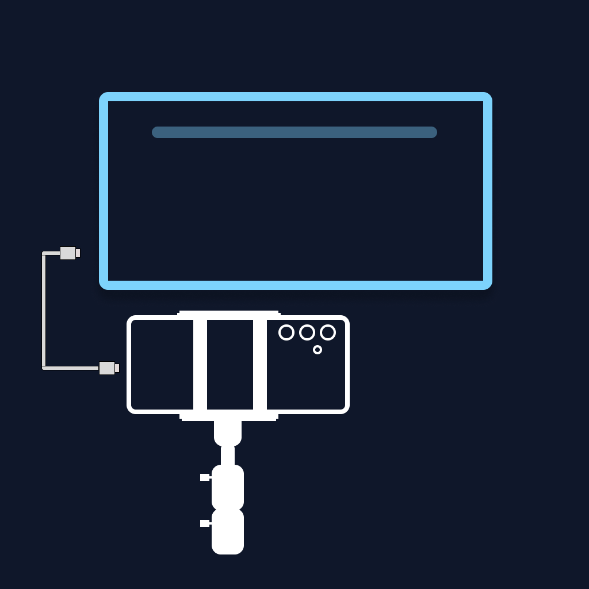
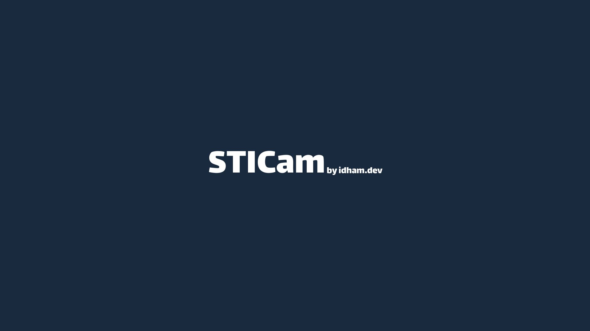
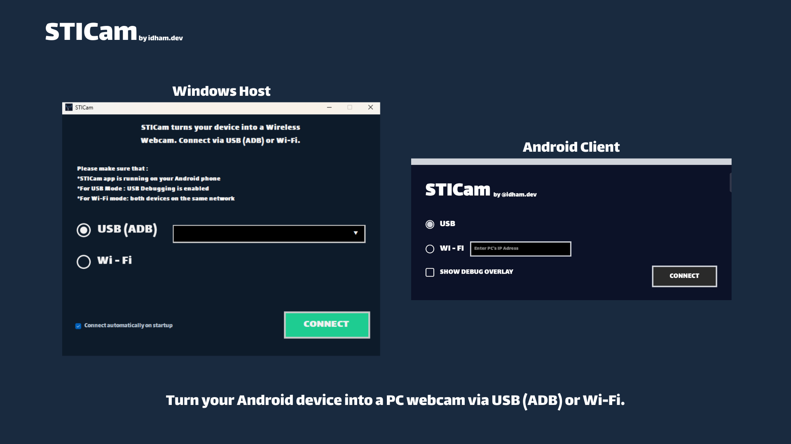
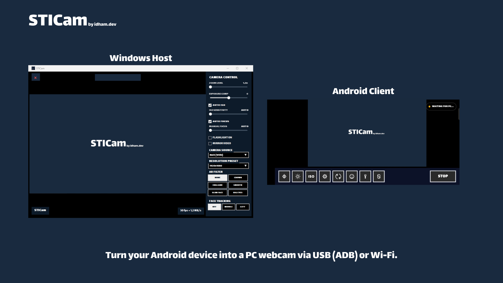

# STICam

**Turn an Android phone into a Windows webcam over Wi-Fi or USB.**

Free to use, works offline, and no account required.

> [!IMPORTANT]
> The original Android v1.0.0 release includes MediaPipe's upstream metrics transport.
> Google says it sends performance/utilization metrics, not image or video input. The
> Android v1.0.1 removes that transport. Update to the latest release and see the
> version-specific [Privacy Policy](PRIVACY.md).

---

> **Requires Windows 11** 22H2 (build 22621) or newer and **Android 8.0**
> (API 26) or newer. The Windows installer supplies the required Microsoft
> .NET 10 Runtime when it is not already installed.

## Features

| | |
| --- | --- |
| **Wi-Fi and USB streaming** | Stream H.264 video to the Windows host over a trusted local network or an ADB USB connection. |
| **Multi-device USB selection** | If several authorized phones are connected, choose the intended device without unplugging the others. |
| **AI auto-framing** | On-device MediaPipe face tracking keeps the subject framed without sending face data to a server. |
| **Manual camera control** | Control zoom, exposure, ISO, focus, flashlight, camera, resolution, and mirroring from Windows. |
| **AR filters** | Apply optional on-device face effects from the Windows control panel. |
| **Windows virtual camera** | Use STICam in Discord, Zoom, Teams, OBS, the Windows Camera app, and other compatible applications. |
| **Automatic reconnection** | Resume the stream after a temporary interruption. |
| **Private by design** | No account, subscription, ads, cloud processing, or developer-operated server. MediaPipe metrics are removed in Android v1.0.1; v1.0.0 is disclosed in the Privacy Policy. |

## Screenshots

### Connection setup

### Live streaming and controls

## Install

Download both files from the
[latest GitHub Release](https://github.com/idhamdotdev/STICam/releases/latest):

- `STICam_v1.0.1.apk` — Android application
- `STICam_Installer_v1.0.1.exe` — Windows application and virtual camera

Verify both files against the SHA-256 values in the release notes before installing.
See [Verifying your download](docs/VERIFYING-DOWNLOADS.md).

## Connect

### USB

1. Enable USB debugging on the phone.
2. Connect the phone and approve the debugging prompt.
3. Choose **USB** in both applications.
4. If the host detects more than one authorized phone, select the intended device.
5. Click **Connect** on Windows, then start the stream on Android.

The Windows host configures the required ADB reverse tunnel automatically and stays
locked to the selected device.

### Wi-Fi

1. Put the phone and PC on the same trusted private network.
2. Choose **Wi-Fi** in STICam on Windows and click **Connect**.
3. Enter the IP address shown by the host in the Android app.
4. Start the stream on Android.

If Windows prompts for firewall access, allow STICam on private networks only.

> [!WARNING]
> Wi-Fi video and controls are not authenticated or encrypted. Use Wi-Fi mode only
> on a network you trust. Prefer USB on shared or public networks. Read
> [SECURITY.md](SECURITY.md) for the complete security model.

### Virtual camera

The virtual camera starts automatically when the live preview is ready. Select
**STICam** in the video application you want to use.

The camera presents a fixed 1920×1080 output to Windows applications. Other incoming
resolutions are scaled and letterboxed while preserving aspect ratio.

## Known limitation

Deliberate, very rapid camera switching can occasionally fail. Normal camera switching
is reliable. Camera, resolution, and filter controls are temporarily disabled during a
switch so commands cannot stack up.

## Documentation

| Document | Purpose |
| --- | --- |
| [CHANGELOG.md](CHANGELOG.md) | Released versions and user-visible changes |
| [PRIVACY.md](PRIVACY.md) | Data handling and permissions |
| [SECURITY.md](SECURITY.md) | Security model and vulnerability reporting |
| [EULA.md](EULA.md) | End User License Agreement |
| [COPYRIGHT.md](COPYRIGHT.md) | Authorship and ownership |
| [THIRD-PARTY-NOTICES.md](THIRD-PARTY-NOTICES.md) | Third-party components and licenses |
| [docs/VERIFYING-DOWNLOADS.md](docs/VERIFYING-DOWNLOADS.md) | Binary verification instructions |

## License and source code

STICam is proprietary freeware. The official applications are free to download,
install, and use, including for internal business use. The source code is private and
is not included in this repository. See [EULA.md](EULA.md) for the complete terms.

This repository is the official product page, documentation hub, issue tracker, and
download location. Third-party components remain under their own licenses as listed in
[THIRD-PARTY-NOTICES.md](THIRD-PARTY-NOTICES.md).

## Support

- Bugs and feature requests: [GitHub Issues](https://github.com/idhamdotdev/STICam/issues/new/choose)
- Security reports: follow [SECURITY.md](SECURITY.md)
- Commercial enquiries and support: **hello@idham.dev**

**Idham — idham.dev**

[idham.dev](https://idham.dev) · hello@idham.dev

Copyright © 2026 Idham (idham.dev). All rights reserved.

